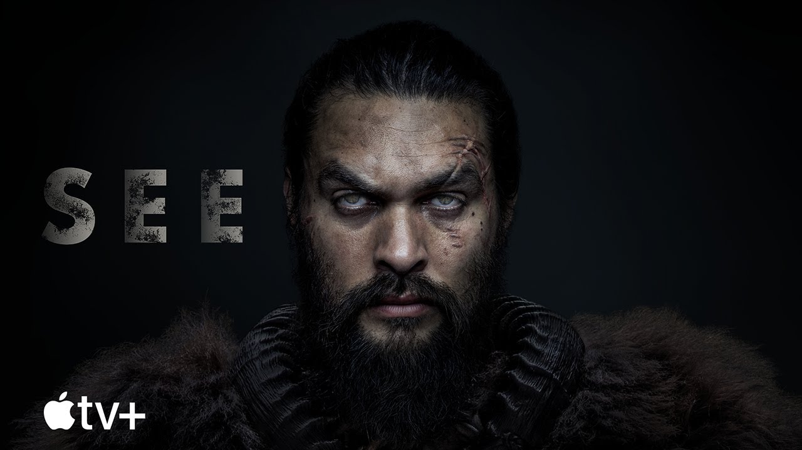

# Enis Öksüz

## Hakkımda

Merhaba, ben Enis Öksüz. Yalova üniversitesinde okuyorum. Yazılım ve teknoloji alanlarından kendimi geliştirmeyi çok seviyorum. Bu eğitim serisi sayesinde keyif alarak ve arkadaşım ile beraber rekabet ederek çok güzel bilgiler öğreniyorum.

### Okuduğum Kitaplar

- Sefiller

    [goodreads](https://www.goodreads.com/book/show/17905288-the-wretched?from_search=true&from_srp=true&qid=KCqmWsbrbv&rank=1)
- İki şehrin hikayesi

### İzlediğim Dizi Ve Filmler

### 1. Filmler

* Hızlı ve öfkeli 9
* Ejder yumruk

### 2. Diziler

- See
- The Witcher

------------------------------------------------------------------------

### En Sevdiğim Dizi

Dünya da salgın hastalık yüzünden tüm insanlar kör oluyor ve doğan çocuklarda kör doğuyor. Gören insanlar ise şeytan ve günahkar olarak nitelendiriliyor.

[IMDB](https://www.imdb.com/title/tt7949218/)

------------------------------------------------------------------------

### Yaptığım Sporlar

- karate
- street workout
- bisiklet sürmek

### Gelecek planlarım

Web geliştirmede frontend kısmında kendimi geliştirip sonrasında backend ile birleştirmek istiyorum. Bu iki kısımda kendimi iyice geliştirdikten sonra full stack developer olarak kariyerime devam etmek istiyorum.
